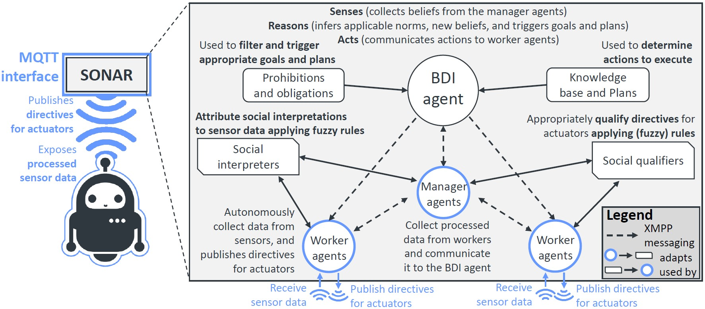
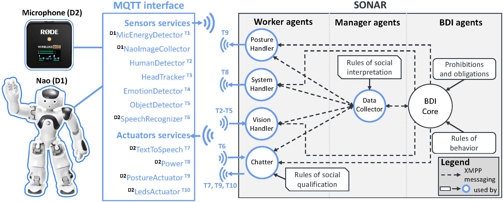

[](https://doi.org/10.5281/zenodo.10719808)

# SONAR: An Adaptive Control Architecture for SOcial Norm Aware Robots


SONAR is a Python 3.9 resource that provides robot-agnostic decision-making mechanisms for social robots that allow them to account for social norms, practices and cues in interactions with humans.

SONAR is technically a multi-agent system with a hierarchical organization. 

At the top of the hierarchy there is one [BDI (Belief-Desires-Intention)](https://en.wikipedia.org/wiki/Belief%E2%80%93desire%E2%80%93intention_software_model) agent, which determines and handles the sense-reasoning-acting cycle of the robot following the BDI model.

Below the BDI agent in the hierarchy there are different worker agents that run in parallel, each of them performing specific autonomous tasks.

Some worker agents handle specific aspects of robotic behaviors and sensing.
For example, the vision handler worker handles aspects related to the vision of the robot.
The posture handler worker handles aspects related to the movements of the robot.
The chatter worker handles aspects related to the communication with humans.

Other worker agents perform tasks internal to the multi-agent system. For example, the data collector worker collects the most recent data from other worker agents and process them in order to create beliefs to provide to the BDI agent. The norm adapter agent regularly performs norm adaptation based on the data collected over time.

SONAR is decoupled from any specific implementation of a robot. 
Commands for and inputs from the robot (or other devices) are given and received via MQTT. [MQTT](https://en.wikipedia.org/wiki/MQTT) is a lightweight method of carrying out messaging using a publish/subscribe model, and the standard messaging protocol for the Internet of Things.

SONAR has been effectively used to control a [Nao robot](https://www.aldebaran.com/en/nao) by establishing MQTT communication between SONAR and the [MQTT-Nao-Interface](https://github.com/dellannadavide/MQTT-Nao-Interface) (see image below for an overview).
Services from both SONAR and MQTT-Nao-Interface subscribe to or publish messages to an MQTT broker.
This allows for decoupling between the specific interface with the robot or other devices (e.g., microphones, cameras, or IoT devices) and SONAR. 

Specifically concerning the MQTT-Nao-Interface, such an interface runs, due to compatibility constraints with the NAOqi Python SDK, on Python 2.7 (not well supported anymore as of 2022). 
Decoupling such an interface from the implementation of SONAR, facilitates the implementation of several modern features that rely on libraries based on Python 3.x.




Below are reported the structure of this repository, and the steps required to install and run SONAR.

## 1. Structure of this repository
```
SONAR
└───data                                    # Data used in the experiments for HRI and for norm-adaptation via simulation
│   └───fuzzy_rules                         # Data containing info about the fuzzy sets, linguistic variables and fuzzy rules 
│   │   │                                   # used in the experiments.
│   │   └───social_interpretation2sim       # Data for the norm-adaptation comupter simulations experiments
│   │   └───social_interpretationHRI        # Data for HRI experiments
│   └───societies_norms                     # Data sets of synthesized interactions, used in the norm-adaptation experiments
│
└───experiments_adaptation                  # Scripts to run the norm-adaptation computer simulations experiments
│   └───results                             # Folder containing the results of the experiments reported in the paper, 
│   │   │                                   # and the results of experiments that will be generated if running the script 
│   │   └───final                           # Final results files of experiments reported in the paper
│   │   analyze_adaptation_results.py       # Script to run to automatically analyze the results 
│   │                                       # (needs specification of the correct results folder)
│   │   plot_mfs.py                         # Script to plot membership functions
│   │                                       # (needs specification of results file and index of iteration in the file)
│   └───utils                               # Utils files used for preparation of experiments (can be ignored) 
│   normadapter2SIMnoagent.py               # Python file representing the norm adapter agent. 
│                                           # This is actually the file that performs the norm adaptation. 
│                                           # Since we are not in the MAS, the norm adapter is *not* an agent, for simplicity.
│   run_experiment_adaptation_commandline.py# Python file that is called by the other run_experiment_adaptation_* files 
│                                           # to actually run all the experiments
│   run_experiment_adaptation_*             # Python files to be used to set all the combinations of parameters to be run, 
│                                           # and run them by automatically invoking the _commandline.py file. 
│                                           # The _local.py file supports execution of experiments on local machine
│                                           # The other files support execution of experiments on HPC
│
└───experiments_adaptation                  # All the results, material, execution logs, dataset conversation, 
│   │                                       # of the HRI experiments with Nao robot
│   └───log                                 # Execution logs                     
│
└───log                                     # Folder that will contain the logs of execution, if the MAS is run
│
└───mas                                     # Folder containing all the code of the MAS and agents of SONAR
│   └───agent                               # Folder containing all the agents                     
│   │   └───worker                          # Folder containing all the worker agents                    
│   │   bdicore.py                          # The BDI agents                     
│   │   workeragent.py                      # The abstract class implemented by all the worker agents                     
│   └───norm                                # Folder containing all the modules concerning normative reasoning                     
│   └───utils                               # Folder containing util files for the mas and the agents                     
│   basic2.asl                              # The AgentSpeak(L) plan library used by Nao-SONAR in the HRI experiments
│   basic_minimal_baseline.asl              # The AgentSpeak(L) plan library used by Nao-Chatbot in the HRI experiments
│   basic_showcase_parrot.asl               # The AgentSpeak(L) plan library used by Nao-Parrot in the introduction of the HRI experiments
│   
└───utils                                   # Utilities for SONAR
│
│   README.md                               # This file
│   main.py                                 # Main file to run SONAR. It defines the agents composing the MAS and starts it                   
│   requirements.txt                        # The list of libraries required to setup and run SONAR
│   sonar.jpg                               # A figure that overviews the SONAR architecture
```

## 2. Basic services required to run SONAR
### 2.1. XMPP communication server.
SONAR makes use of the Python library [SPADE](https://spade-mas.readthedocs.io/en/latest/readme.html), which is a Multi-agent platform based on [XMPP](https://xmpp.org/) (the open universal messaging standard). SPADE requires access to an XMPP communication server. 
Below, it is reported a quick tutorial on how to install [Prosody](https://prosody.im/), the SPADE recommended XMPP server, on Windows 10. 
For more details see the [SPADE quick start](https://spade-mas.readthedocs.io/en/latest/usage.html) and the [Prosody guidelines](https://prosody.im/download/start#windows).
#### 2.1.1. Install Linux on Windows with WSL (see [Microsoft guidelines](https://learn.microsoft.com/en-us/windows/wsl/install))
>1. Open Windows PowerShell with admin rights
>2. Run ``` wsl --install ```
>3. Reboot the system 
>4. Open Microsoft Store and type and get Ubuntu
>5. Follow the instruction in the Ubuntu terminal to create a new UNIX user account.
>6. Run ``` sudo apt update && sudo apt upgrade```  to update packages.
#### 2.1.2. Install Prosody on Ubuntu
>1. In the Ubuntu terminal, as per step 6 of Sec 2.1.1., run ``` sudo apt install prosody ``` and type ```Y``` when requested.
>2. That's it. See Section 4.2.1. for details on how to create accounts for the SPADE agents.
#### 2.1.3. Start Prosody service
>In the Ubuntu terminal, run ``` sudo service prosody start ```

### 2.2. MQTT message broker
Below, it is reported a very quick tutorial on how to install [Eclipse Mosquitto](https://mosquitto.org/), an open source message broker that implements the MQTT protocol, on the Ubuntu distro installed as per Section 2.1.1.

#### 2.2.1. Install and start Mosquitto on Ubuntu
>1. In the Ubuntu terminal, as per step 6 of Sec 2.1.1., add the mosquitto-dev PPA by running first ```sudo apt-add-repository ppa:mosquitto-dev/mosquitto-ppa``` and then ```sudo apt-get update```.
>2. To install Mosquitto, run ``` sudo apt install mosquitto ``` and type ```Y``` when requested.
>3. To start Mosquitto, run ``` sudo service mosquitto start ```

## 3. Setup SONAR
### 3.1. Required software and libraries
SONAR is a python resource that runs on Python 3.9. Therefore the basic requirement is [Python 3.9](https://www.python.org/downloads/).

SONAR makes extensive use of a variety of state-of-the-art libraries for, among others: multi-agent communication; natural language processing, understanding and generation; Fuzzy Inference, Multi-Objective optimization, Belief-Desire-Intention-based inference. 
For this reason, after having set up the Python environment, a number of Python packages need to be installed. The list of requirements can be found in the ```requirements.txt``` file.
A standard way to install all required packages is to run command ```pip install -r /path/to/requirements.txt```. Based on your environment you may adopt the most handy procedure.

Additionally, as per Section 2, SONAR relies on XMPP and MQTT services. Follow steps in Section 2 to install them.

>**Notes** 
> 1. [SPADE](https://pypi.org/project/spade/) depends on some packages that require the [Microsoft C++ Build Tools](https://visualstudio.microsoft.com/visual-cpp-build-tools/) to be installed.
> 2. [Tokenizers](https://pypi.org/project/tokenizers/) might require to install a Rust compiler. On Windows, this can be easily installed from [https://rustup.rs/](https://rustup.rs/)
> 3. SONAR makes extensive use of pretrained language models, which will be downloaded (if not available already) at the first execution. The whole set of models might require a couple of GB of space on the hard drive.
> 4. [Spacy](https://spacy.io/usage) requires the model ```en_core_web_sm```. This can be installed by running ```python -m spacy download en_core_web_sm```.

### 3.2. Setup and Run
#### 3.2.1 Register the agents in the XMPP server
The first step required in order to allow communication between agents in SONAR is to register the agents in the XMPP server with a ```jid``` and a ```password```.
This step only needs to be done once.

Following the [guidelines from the SPADE library](https://spade-mas.readthedocs.io/en/latest/usage.html), the jid (e.g., <agent_name>@<your_xmpp_server>) contains the agent’s name (before the @) and the DNS or IP of the XMPP server (after the @). 

> **Example.** Assuming that you installed the Prosody XMPP server locally by following the steps indicated in Section 2.1, the server IP will be by default ```localhost```.
An example of <agent_name> that operates in SONAR is ```sonar_chatter```. In the default settings, therefore such an agent will have jid ```sonar_chatter@localhost```.

The list of required agents and XMPP-related information (e.g., name, server, jid, pwd) can be found at the bottom of file ```SONAR/utils/constants.py```. 
All agents in the ```XMPP_AGENTS_DETAILS``` data structure should be registered in the XMPP server.

> **Tip.** You can extend or modify such a data structure if you run the agents on a different IP, if you want to give different names to the agents in the XMPP server, or if you want to add additional agents.

To register the required SONAR agents on Prosody via terminal (see [Prosody guidelines](https://prosody.im/doc/creating_accounts) for more details):
>1. Start Prosody as per section 2.1.3
>2. Register an agent by running ```sudo prosodyctl adduser <agent_name>@<your_xmpp_server>```, and by providing the password for the agent as indicated in file ```SONAR.utils.constants.py```.
>3. Repeat step 2 for all agents indicated in ```XMPP_AGENTS_DETAILS```.
>4. Verify that all agents have been created by listing the accounts registered in Prosody by running ```sudo ls /var/lib/prosody/localhost/accounts```. The output should contain the list of registered accounts on server ```localhost```.

#### 3.2.2 Run SONAR
>1. Start Prosody as per section 2.1.3
>2. Start Mosquitto as per section 2.2.1
>3. Run SONAR via ```python SONAR/main.py```.

At this point SONAR should be running, with the several agents communicating between each other, and waiting for messages to be received via the MQTT broker (e.g., by the [MQTT-Nao-Interface](https://github.com/dellannadavide/MQTT-Nao-Interface)).

